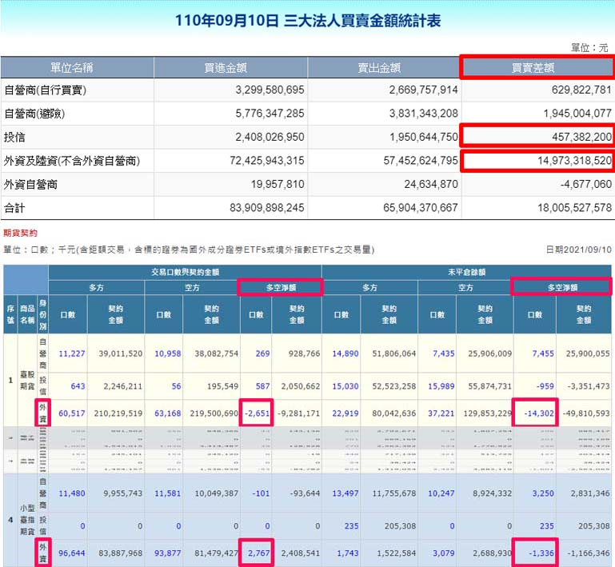

(unfinished)
# Application

用證交所盤後揭露的現貨買賣超 + 期交所的法人期貨部位  預測隔天台指期是紅K棒或黑K棒

使用**隨機森林**的`樣本隨機`＆`特徵隨機`來預測

資料蒐集、特徵工程、因子顯著性排序，交易策略回測、模型評估

回測時間範圍：2019-01-01 ~ 2021-09-10

##### 資料來源：[臺灣證券交易所](https://www.twse.com.tw/zh/page/trading/fund/BFI82U.html)／[臺灣期貨交易所](https://www.taifex.com.tw/cht/3/futContractsDate)

name|counts
---|---
Samples total|566
Dimensionality|11+
Features|Int
Target|Boolean,0,1

# Tools
sklearn, requests, BeautifulSoup, pandas, numpy, Randomforest, graphviz,

目錄:
> 取得資料→前處理→轉換→分析→解釋→論述 
> Selection => Preprocessing => Transformation => Knowledge Discovery in Database(Data Mining) => Interpretation Evaluation

# 預處理、特徵轉換、資料分佈
類別字串類需One-Hot Encoding處理(純數值不需處理畢竟決策樹只二分)

# 隨機森林圖像化
決定深度、截枝與否

# ROC AUC模型評估
徵特質純化

# 回測
Backtesting
